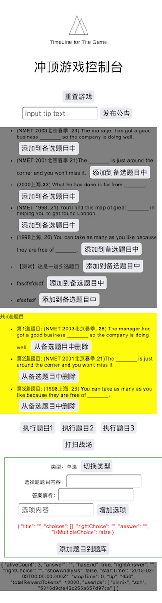

# game control board

> Control board of the game.





## Build Setup

``` bash
# install dependencies
$ npm install # Or yarn install

# serve with hot reload at localhost:3000
$ npm run dev

# build for production and launch server
$ npm start
```


With the power of
- [Nuxt.js project](https://github.com/nuxt/nuxt.js)
- [Wilddog](https://www.wilddog.com)
- [backpack](https://github.com/palmerhq/backpack)
